# Minecraft Structure to EDGE Level Converter

This is a tool to convert Minecraft structure files to EDGE levels. See [CatLooks’s level documentation](https://catlooks.github.io/edge/doc) for additional info on all used terms.

Because of different structure file formats, the tool only works for .nbt structure files created on Minecraft Java Edition. 

## Table of Contents
1. [Level Parameters](#level-parameters)
2. [Static Level Parts](#static-level-parts)
3. [Dynamic Level Parts](#dynamic-level-parts)
4. [Saving and Converting a Structure](#saving-and-converting-a-structure)
5. [Using the Script](#using-the-script)

# Level Parameters

| Tag          | Minecraft Representation |                                       |
|--------------|--------------------------|---------------------------------------|
| `SpawnPoint` | **Gold Block**           |     |
| `ExitPoint`  | **Emerald Block**        |  |
| `Size`       | Size of structure(s)     |                                       |

Other level parameters are written in a **Book** with `Level [filename]` as its first line. The book has to be put in a **Lectern** located anywhere in the structure. Parameters are `key=value` pairs separated by new lines:

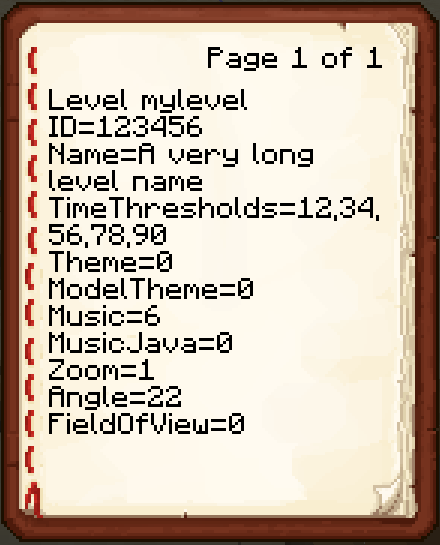

# Static Level Parts

|                                                                                                                                                                                                                                                                                                    | Block        | Brightness           | Height | RGB                  | Minecraft Representation                         |                                                                                                                                                                                                                                                                                                                                                                                                                                                         |
|----------------------------------------------------------------------------------------------------------------------------------------------------------------------------------------------------------------------------------------------------------------------------------------------------|--------------|----------------------|--------|----------------------|--------------------------------------------------|---------------------------------------------------------------------------------------------------------------------------------------------------------------------------------------------------------------------------------------------------------------------------------------------------------------------------------------------------------------------------------------------------------------------------------------------------------|
|                                                                                                                                                                                                          | Common       | 0                    | Full   | `#FFFFFF`            | **Quartz Block**                                 |                                                                                                                                                                                                                                                                                                                                                    |
|                                                                                                                                                                                                     | Common       | 0                    | Half   | `#FFFF80`            | **Quartz Slab**                                  | 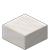                                                                                                                                                                                                                                                                                                                                                    |
|                                                                           | Common       | -1, -2, -3           | Full   | `#FF(80,40,00)FF`    | **Oak, Spruce, Dark Oak Planks**                 | 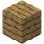 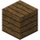 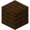                                                                                                                                     |
|    | Common       | -1, -2, -3           | Half   | `#FF(80,40,00)80`    | **Oak, Spruce, Dark Oak Slab**                   | 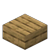  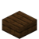                                                                                                                                           |
| 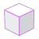                                                                                                                                                                                             | Luminous     | -3 (Does not matter) | Full   | `#E00000`            | **Smooth Stone**                                 | 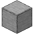                                                                                                                                                                                                                                                                                                                                                   |
|                                                                                                                                                                                              | Luminous     | -3 (Does not matter) | Half   | `#C00000`            | **Smooth Stone Slab**                            | 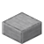                                                                                                                                                                                                                                                                                                                                              |
|                                                                                                                                                                                                                                                                                                    | No collision | 0, -1, -2, -3        | Full   | `#00(FF,80,40,00)FF` | **White, Light Gray, Gray, Black Stained Glass** |     |
|                                                                                                                                                                                                                                                                                                    | Invisible    | -3 (Does not matter) | 0      | `#FF0000`            | **Glass**                                        | 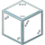                                                                                                                                                                                                                                                                                                                                                          |

To create a block with a custom RGB value, place a **sign** with the desired value written on its first line.

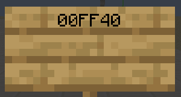

# Dynamic Level Parts

Most dynamic level parts have so many parameters that **containers** (Shulker Boxes, Barrels, Chests) have to be used as their representation. The position of the part corresponds to the position of the container. Parameters are represented either by items or a book inside the container. The book contains `key=value` pairs separated by new lines, just as done for the level parameters.
Note: If preferred, every parameter that is represented by items in containers can also be written inside a book. Parameters from the book overwrite parameters from items in the container.

## Common parameter items

### Timing

Some parts have one or two parameters that specify an amount of ticks, e.g. `TravelTime` or `PauseTime`. These are represented in the following way:

| Data                                           | Item            |                                                                                                      |
|------------------------------------------------|-----------------|------------------------------------------------------------------------------------------------------|
| First parameter: 1 tick per item               | **Iron Nugget** | 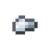 |
| First parameter: 1 second (30 ticks) per item  | **Iron Ingot**  | 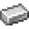  |
| Second parameter: 1 tick per item              | **Gold Nugget** | 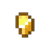 |
| Second parameter: 1 second (30 ticks) per item | **Gold Ingot**  | 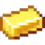  |

### Visibility

Some parts have a `Visible="[True,False(,Null)]`" parameter:

| Value   | Item                     |                                                                                                              |
|---------|--------------------------|--------------------------------------------------------------------------------------------------------------|
| `True`  | No item (always default) |                                                                                                              |
| `False` | **Glass**                |                |
| `Null`  | **White Stained Glass**  |  |

### Radius

Some parts have a `Radius="[x],[y]"` parameter:

| Data | Value                          |                                                                                                           |
|------|--------------------------------|-----------------------------------------------------------------------------------------------------------|
| `x`  | Amount of **Prismarine Shard** | 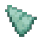 |
| `y`  | Amount of **Stick**            | 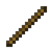            |

Note that the orientation of the items matches the orientation of the corresponding axis.

## [MovingPlatform](https://catlooks.github.io/edge/doc/#tag-mp)

 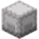
- Representation: **White Shulker Box**
- Items:
    - `WaypointItem`: An arbitrary item that has to be unique for each MovingPlatform and has to be in the first slot. Used to sync MovingPlatforms with their Waypoints. Items that indicate other parameters are not allowed. The amount of that item denotes the value of the `LoopStartIndex` parameter.
    - `TravelTime` (**iron Nugget/Ingot**) and `PauseTime` (**Gold Nugget/Ingot**) for the first waypoint which is the position of the MovingPlatform.
    - `FullBlock = False`: **Quartz Slab**
    - `AutoStart = False`: **Red Wool**
- Book: `ID`, `RelatedTo`, `Offset`

### [Waypoint](https://catlooks.github.io/edge/doc/#tag-wp)

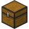
- Representation: **Chest**
- Items:
    - `WaypointItem` of corresponding MovingPlatform. The amount of that item corresponds to the index of the waypoint (having one of that item in a chest means it is the first waypoint, having two of it means the second waypoint and so on). Note: If you want your waypoint indices to match the indices used by the `LoopStartIndex` parameter, you have to start with index 2 since the platform’s initial position counts as its first waypoint.
    - `TravelTime` (**Iron Nugget/Ingot**) and `PauseTime` (**Gold Nugget/Ingot**)

Example: This chest marks the third waypoint for the platform with `WaypointItem` of Stone. It has a `TravelTime` of 2.5 seconds (2 seconds + 15 ticks) and a `PauseTime` of 3 seconds.

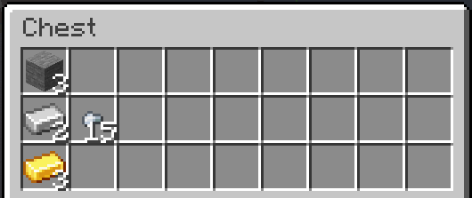

## [FallingPlatform](https://catlooks.github.io/edge/doc/#tag-fp)

 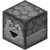
- Representation: **Dropper**
- Items: `FloatTime` (**Iron Nugget/Ingot**)

## [Bumper](https://catlooks.github.io/edge/doc/#tag-bmp)

 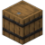
- Representation: **Barrel**
- The Bumper is facing in the same direction as the barrel’s lid
- Items:
    - `StartDelay` (**Iron Nugget/Ingot**), `PulseRate` (**Gold Nugget/Ingot**)
    - `Enabled = False`: **Red Wool**
- Book: `ID`

## [Button](https://catlooks.github.io/edge/doc/#tag-btn)

 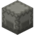
- Representation: **Light Gray Shulker Box**
- When placed on a MovingPlatform that has an `ID`, the Button will automatically be attached to that platform
- Items:
    - `Visible`: False = **Glass**, Null = **White Stained Glass**
    - `DisableCount`: Amount of **Stone Button**
- Book: `ID`, `Mode`, `TriggerAchievements`, `AffectMovingPlatforms`, `AffectButtons`, `AffectBumpers`

## [Resizer](https://catlooks.github.io/edge/doc/#tag-rgs)

 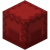 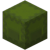
- ResizerGrow: **Red Shulker Box**
- ResizerShrink: **Green Shulker Box**
- Items:
    - `Visible = False`: **Glass**
    - `Radius`: `x` = **Prismarine Shard**, `y` = **Stick**

## [OtherCube and DarkCube](https://catlooks.github.io/edge/doc/#tag-odc)

 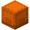

 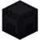
- OtherCube: **Orange Shulker Box**
- DarkCube: **Black Shulker Box**
- The Position of the Shulker Box corresponds to `PositionTrigger`
- Items:
    - `Radius`: `x` = **Prismarine Shard**, `y` = **Stick**
- Book: `PositionCube`, `MovingBlockSync`, `KeyEvents`
    - `PositionCube`: You can use relative coordinates with ~ just like in Minecraft
    - KeyEvents are entered in the following way: `[N,S,W,E][D,U][TimeOffset]`, e.g. a NorthDown input after 100 ticks would be `ND100`. KeyEvents are separated by commas.

## [Checkpoint](https://catlooks.github.io/edge/doc/#tag-cp)

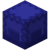
- Representation: **Blue Shulker Box**
- Items:
    - `Radius`: `x` = **Prismarine Shard**, `y` = **Stick**
    - `RespawnZ`: Amount of **Arrow** corresponds to respawn height relative to the height of the checkpoint (e.g. 2 Arrows mean you respawn 2 blocks above the checkpoint)

## [CameraTrigger](https://catlooks.github.io/edge/doc/#tag-ct)

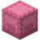
- Representation: **Pink Shulker Box**
- Items: `StartDelay` (**Iron Nugget/Ingot**), `Duration` (**Gold Nugget/Ingot**)
- Book: `Zoom`, `Angle`, `FieldOfView`, `SingleUse`

## [ButtonSequence](https://catlooks.github.io/edge/doc/#tag-bs)

- Representation: **Lectern** located anywhere inside the structure
- Book: `ButtonIDs` (comma-separated list), `SequenceInOrder`, `TriggerAchievements`, `AffectMovingPlatforms`, `AffectButtons`, `AffectBumpers`

## [Prism](https://catlooks.github.io/edge/doc/#tag-psm)

 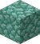
- Representation: **Prismarine** (No container needed)

## Summary

| Name                                                                                                           | Block                                                                                                                | Timing                                                                                                                                                                                                                                                                                                                                                                                                                                                                                                                                                                                                  | Visibility                                                                                                                                                                                                                                                                                                               | Radius                                                                                                                                                                                                                                                                                                       | Extra                                                                                                                                     | Additional data                                                                                                  | Notes                                                                                                      |
|:---------------------------------------------------------------------------------------------------------------|----------------------------------------------------------------------------------------------------------------------|---------------------------------------------------------------------------------------------------------------------------------------------------------------------------------------------------------------------------------------------------------------------------------------------------------------------------------------------------------------------------------------------------------------------------------------------------------------------------------------------------------------------------------------------------------------------------------------------------------|--------------------------------------------------------------------------------------------------------------------------------------------------------------------------------------------------------------------------------------------------------------------------------------------------------------------------|--------------------------------------------------------------------------------------------------------------------------------------------------------------------------------------------------------------------------------------------------------------------------------------------------------------|-------------------------------------------------------------------------------------------------------------------------------------------|------------------------------------------------------------------------------------------------------------------|------------------------------------------------------------------------------------------------------------|
| **Item**                                                                                                       | /                                                                                                                    | 1.   2.   | `False` =  `Null` =  | `x` = `y` = | Various                                                                                                                                   | **Book** with one `key=value` pair per line. Parameters in the book overwrite items in the container.            |                                                                                                            |
|     |       | 1. `TravelTime` (of first waypoint)  2. `PauseTime` (of first waypoint)                                                                                                                                                                                                                                                                                                                                                                                                                                                                                                                             | -                                                                                                                                                                                                                                                                                                                        | -                                                                                                                                                                                                                                                                                                            | `WaypointItem`: Arbitrary item (Amount = `LoopStartIndex`) `FullBlock` = False: **Quartz Slab** `AutoStart = False`: **Red Wool** | `ID`, `RelatedTo`, `Offset`                                                                                      | Block position defines position of first waypoint                                                          |
| Waypoint                                                                                                       |                   | 1. `TravelTime` 2. `PauseTime`                                                                                                                                                                                                                                                                                                                                                                                                                                                                                                                                                                      | -                                                                                                                                                                                                                                                                                                                        | -                                                                                                                                                                                                                                                                                                            | -                                                                                                                                         | -                                                                                                                |                                                                                                            |
|  |                 | 1. `FloatTime`                                                                                                                                                                                                                                                                                                                                                                                                                                                                                                                                                                                          | -                                                                                                                                                                                                                                                                                                                        | -                                                                                                                                                                                                                                                                                                            | -                                                                                                                                         | -                                                                                                                |                                                                                                            |
|            |                  | 1. `StartDelay` 2. `PulseRate`                                                                                                                                                                                                                                                                                                                                                                                                                                                                                                                                                                      | -                                                                                                                                                                                                                                                                                                                        | -                                                                                                                                                                                                                                                                                                            | `Enabled = False`: **Red Wool**                                                                                                           | `ID`                                                                                                             | Bumper orientation = Barrel orientation                                                                    |
|            |  | -                                                                                                                                                                                                                                                                                                                                                                                                                                                                                                                                                                                                       | `True` (default), `False`, `Null`                                                                                                                                                                                                                                                                                        | -                                                                                                                                                                                                                                                                                                            | `DisableCount`: Amount of **Stone Button**                                                                                                | `ID`, `Mode`, `TriggerAchievements`, `AffectMovingPlatforms`, `AffectButtons`, `AffectBumpers`                   | Will be attached to a moving platform underneath it if it has an `ID`                                      |
|  (grow)   |         | -                                                                                                                                                                                                                                                                                                                                                                                                                                                                                                                                                                                                       | `True` (default), `False`                                                                                                                                                                                                                                                                                                | `[x],[y]`                                                                                                                                                                                                                                                                                                    | -                                                                                                                                         | -                                                                                                                |                                                                                                            |
|  (shrink) |       | -                                                                                                                                                                                                                                                                                                                                                                                                                                                                                                                                                                                                       | `True` (default), `False`                                                                                                                                                                                                                                                                                                | `[x],[y]`                                                                                                                                                                                                                                                                                                    | -                                                                                                                                         | -                                                                                                                |                                                                                                            |
|         |      | -                                                                                                                                                                                                                                                                                                                                                                                                                                                                                                                                                                                                       | -                                                                                                                                                                                                                                                                                                                        | `[x],[y]`                                                                                                                                                                                                                                                                                                    | -                                                                                                                                         | `PositionCube`, `MovingBlockSync`, `KeyEvents`                                                                   | Shulker Box position denotes `PositionTrigger` Relative coordinates (~) can be used for `PositionCube` |
|          |       | -                                                                                                                                                                                                                                                                                                                                                                                                                                                                                                                                                                                                       | -                                                                                                                                                                                                                                                                                                                        | `[x],[y]`                                                                                                                                                                                                                                                                                                    | -                                                                                                                                         | `PositionCube`, `MovingBlockSync`, `KeyEvents`                                                                   | Shulker Box position denotes `PositionTrigger` Relative coordinates (~) can be used for `PositionCube` |
| Checkpoint                                                                                                     |        | -                                                                                                                                                                                                                                                                                                                                                                                                                                                                                                                                                                                                       | -                                                                                                                                                                                                                                                                                                                        | `[x],[y]`                                                                                                                                                                                                                                                                                                    | `RespawnZ`: **Arrow** (Amount = height above checkpoint)                                                                                  | -                                                                                                                |                                                                                                            |
| CameraTrigger                                                                                                  |        | 1. `StartDelay` 2. `Duration`                                                                                                                                                                                                                                                                                                                                                                                                                                                                                                                                                                       | -                                                                                                                                                                                                                                                                                                                        | -                                                                                                                                                                                                                                                                                                            | -                                                                                                                                         | `Zoom`, `Angle`, `FieldOfView`, `SingleUse`                                                                      |                                                                                                            |
| ButtonSequence                                                                                                 |                 | -                                                                                                                                                                                                                                                                                                                                                                                                                                                                                                                                                                                                       | -                                                                                                                                                                                                                                                                                                                        | -                                                                                                                                                                                                                                                                                                            | -                                                                                                                                         | `ButtonIDs`, `SequenceInOrder`, `TriggerAchievements`, `AffectMovingPlatforms`, `AffectButtons`, `AffectBumpers` | Can be placed anywhere in the structure                                                                    |
|             |              | -                                                                                                                                                                                                                                                                                                                                                                                                                                                                                                                                                                                                       | -                                                                                                                                                                                                                                                                                                                        | -                                                                                                                                                                                                                                                                                                            | -                                                                                                                                         | -                                                                                                                |                                                                                                            |

Better views of this table can be found here:
- [Text (Light mode)](images/summary.png)
- [Text (Dark mode)](images/summary_dark.png)
- [Icons (Light mode)](images/summary_icons.png)
- [Icons (Dark mode)](images/summary_icons_dark.png)

# Saving and Converting a Structure

When building your level, note that the camera in EDGE is facing north-west. You can check your facing direction by pressing F3. 
You have to have cheats enabled in your Minecraft world. Get a structure block by typing `/give @p minecraft:structure_block`. Place the structure block in the bottom-north-west corner of your level. Right-click the structure block and set it into “Save” mode by clicking the button in the bottom left that says “Load” twice. Enter your structure size and click “Done”, and a white outline will appear around your level. Enter a structure name and click “SAVE” in the bottom right to save your structure.

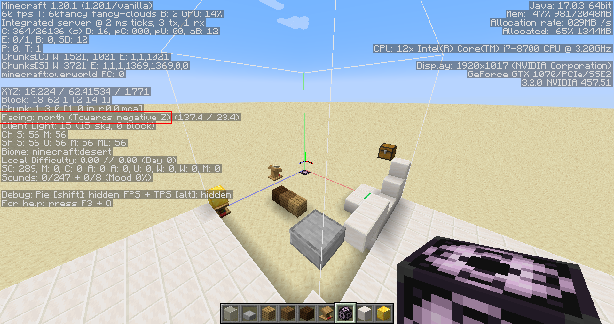

## Levels bigger than 48x48x48

To convert levels bigger than the maximum structure size of 48x48x48, you have to place multiple structure blocks so that they together create a bigger cube. The resulting structures have to be named `[name]_x.y.z` where x, y and z are the **coordinates of the structure.** The structure name you enter into the script is still just `[name]`

Example: To create a 96x96x96 level, you have to place 8 structure blocks and name them in the following way:

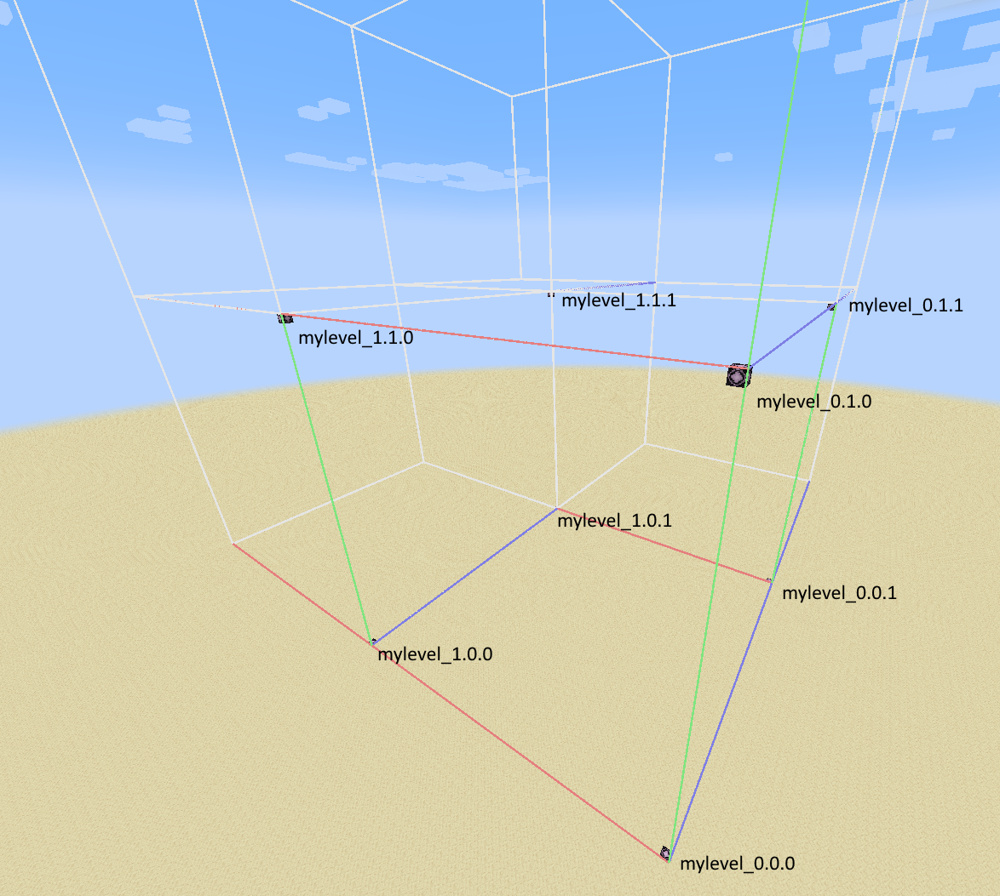

# Using the Script
If you don't have Python, download [structure_to_level.exe](https://github.com/robin-mu/EDGE/raw/main/Level%20Editor/structure_to_level.exe) and run it. Otherwise, you need to have [Python](https://www.python.org/downloads/) and the modules nbt (type `pip install nbt` in your terminal) and pillow (`pip install pillow`) installed. Open your terminal in the same folder as the script. To convert a structure, type

`python.exe structure_to_level.py "[world folder]" "[structure name]"`

`[world folder]` is the name displayed in gray under your world name in the world select screen.

`[structure name]` in the name you wrote into the structure block (without `minecraft:`).

If you specify no `[world folder]`, the script will look for the structure files in your current working directory.

If you have EdgeTool in the same folder as the script, the level will be compiled automatically.