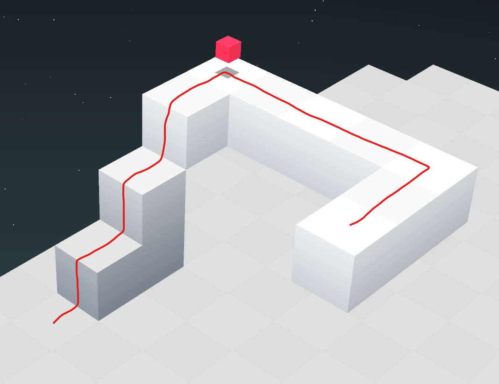

# Usage of these scripts
## `othercube_path_generator.py`

To convert a path into othercube KeyEvents, type `python othercube_path_generator.py direction1 direction2 ...`. Each direction is formatted in the following way:

`[n,e,s,w,p][steps/duration]/[climb1],[climb2],...`

`n,e,s,w` stands for one of the directions north, east, south or west. `[steps]` is the number of steps that are taken in that direction, so `n3` would mean 3 steps north. `[climb1]` and `[climb2]` denote at which steps on its way the cube has to climb and are optional. For example, `e5/1,3` means the cube has to move 3 steps east and climbs at steps 1 and 3.
`p` stands for pause and the number following it is the time in ticks (1/30 of a second) the cube has to pause. For example, `p60` means the cube has to pause for 2 seconds.

Example: The othercube has to follow the path shown on the image and pause for one second at the prism.

For this, you enter `python othercube_path_generator.py n4/1,2,3 p30 e4 s2`.